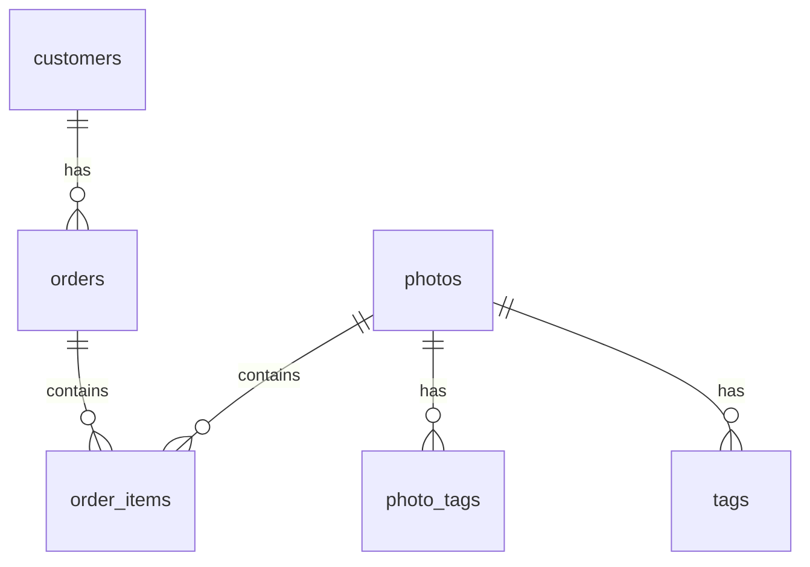

# SQL révision

## Présentation des tables 

1. **customers** : Stocke les informations sur les customers qui ont passé des commandes. Chaque client est identifié par un `client_id` unique.

1. **photos** : Contient les détails des photos disponibles à la vente. Chaque photo est identifiée par un `photo_id` unique.

1. **orders** : Enregistre les commandes passées par les customers. Chaque commande est identifiée par un `order_id` unique. La table a une relation "many-to-one" avec la table `customers`, où plusieurs commandes peuvent être associées à un seul client.

1. **order_items** : Stocke les détails des articles individuels dans chaque commande. Chaque article est identifié par un `order_item_id` unique. La table a des relations "many-to-one" avec les tables `orders` et `photos`, où plusieurs articles peuvent être associés à une seule commande et à une seule photo.

1. **tags** : Contient les étiquettes associées aux photos. Chaque étiquette est identifiée par un `tag_id` unique.

1. **photo_tags** : Établit une relation de plusieurs à plusieurs entre les photos et les étiquettes. Cette table de liaison associe les photos aux étiquettes correspondantes.

En résumé, les relations principales sont les suivantes :
- `customers` -> `orders` : Relation "one-to-many". Un client peut passer plusieurs commandes.
- `orders` -> `order_items` : Relation "one-to-many". Une commande peut contenir plusieurs articles.
- `photos` -> `order_items` : Relation "one-to-many". Une photo peut être incluse dans plusieurs articles de commande.
- `photos` -> `photo_tags` -> `tags` : Relation "many-to-many". Une photo peut avoir plusieurs étiquettes, et une étiquette peut être associée à plusieurs photos.

## Diagramme d'entités



## Partie Docker

Dans adminer pour se connecter on doit faire 
- postgres
- admin
- admin
- shop

  - nom du conteneur : `docker_postgres`

```bash
docker exec -it docker_postgres psql -U admin -d shop /var/lib/postgresql/data/schema.sql
docker exec -it docker_postgres /bin/bash
```