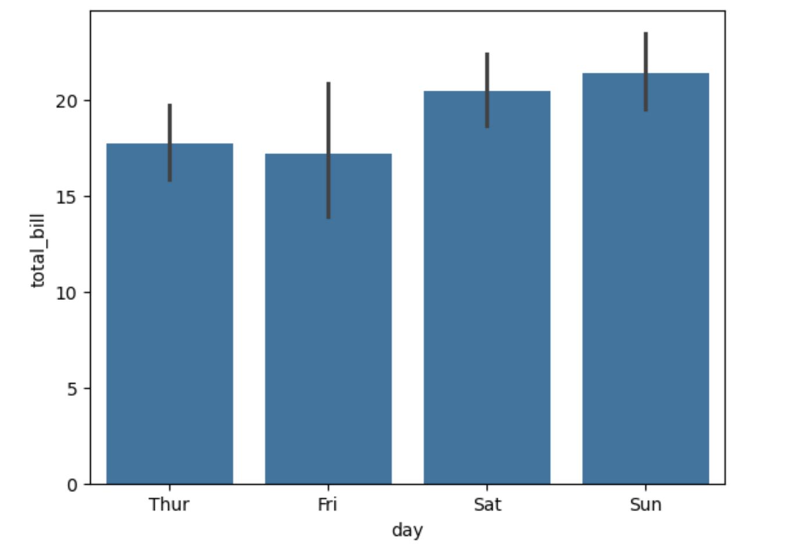
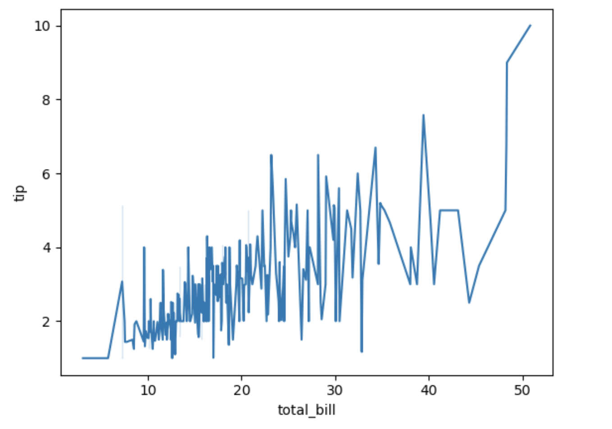
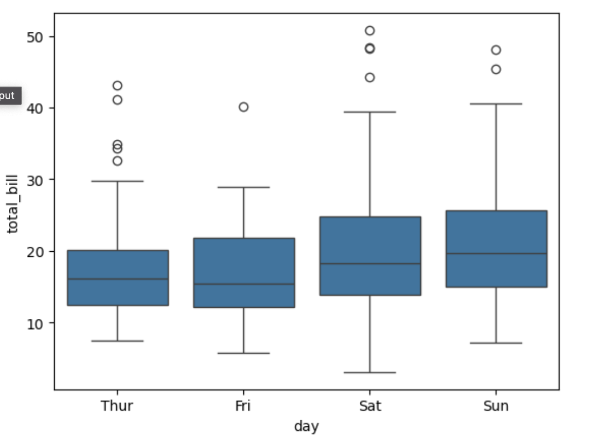
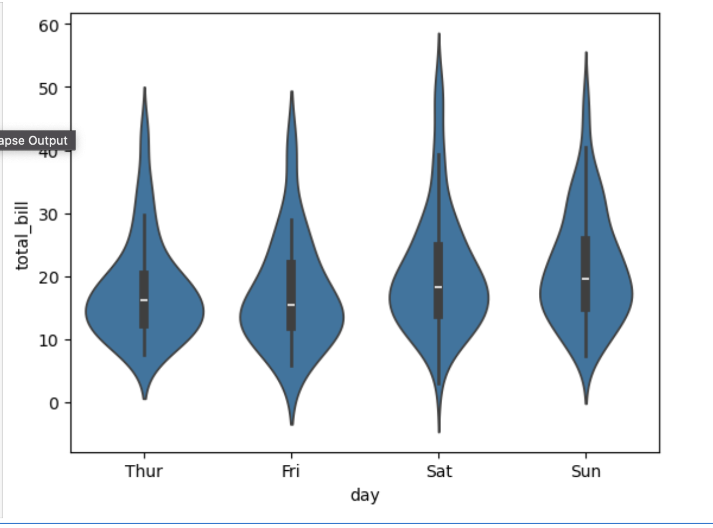
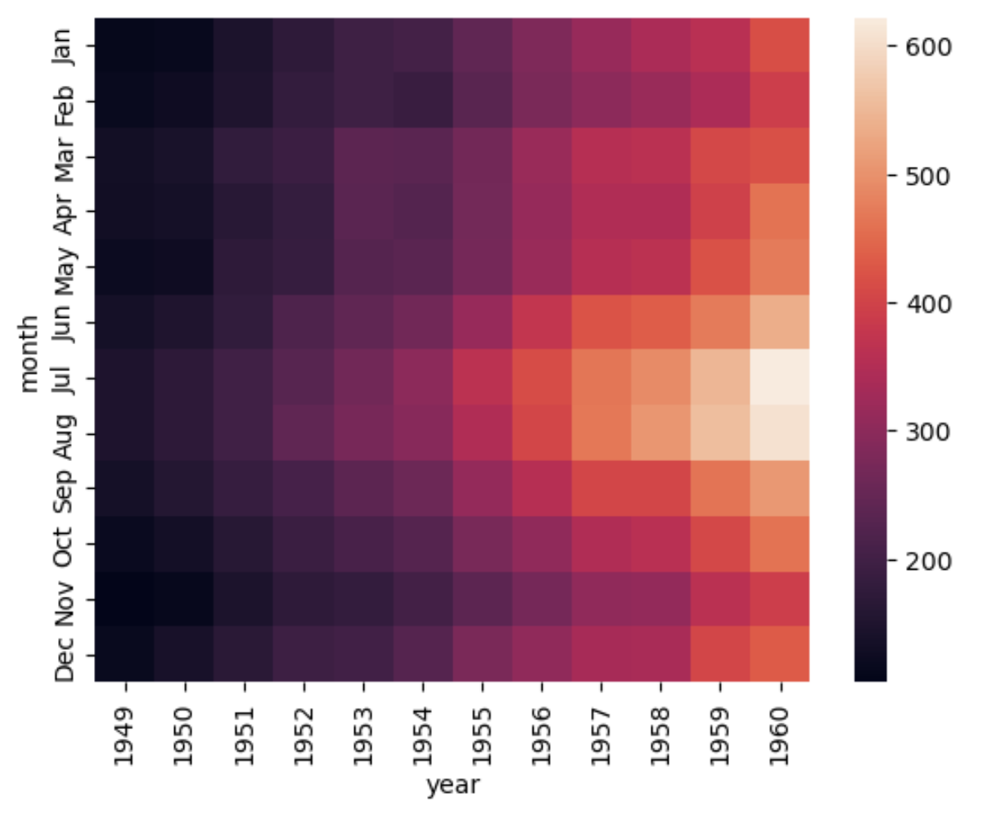
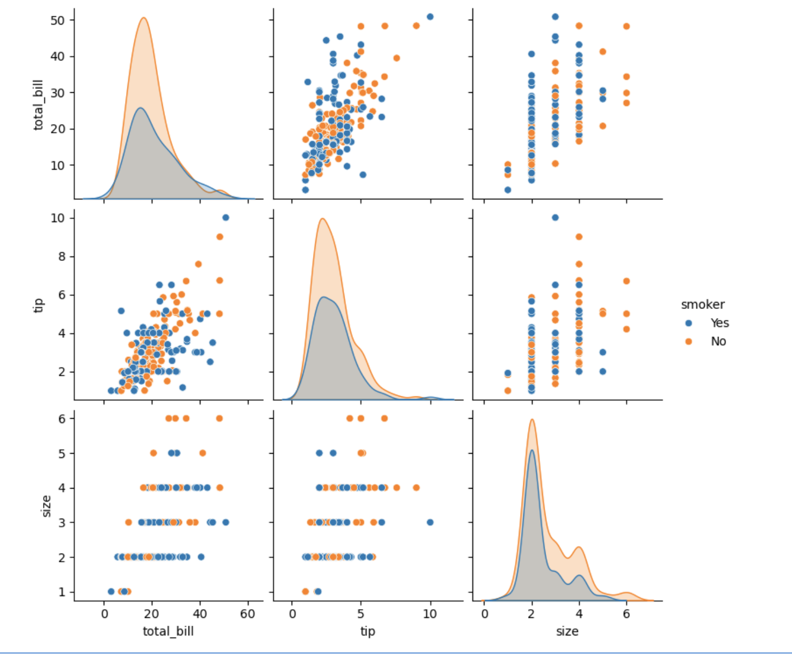
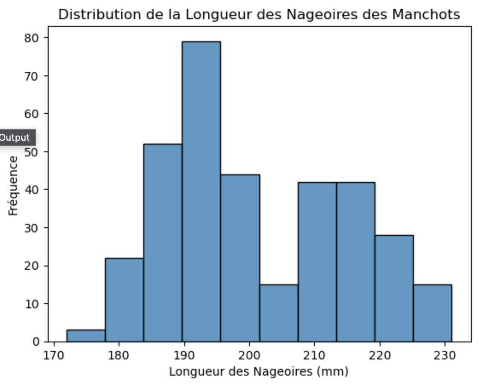

# Statistiques 

## Préalable sur le type de variables

En statistique, une variable est une caractéristique mesurée ou observée sur chaque unité d'analyse dans une étude. 

Les variables peuvent être classées en deux catégories principales : continues et discrètes.

**Variables continues**

Les variables continues sont des variables qui peuvent prendre une infinité de valeurs possibles dans un intervalle donné. Elles sont mesurées sur une échelle continue et peuvent être mesurées avec une précision arbitraire. Les exemples de variables continues incluent la taille, le poids, la température, le temps, etc.

**Variables discrètes**

Les variables discrètes sont des variables **qui ne peuvent prendre qu'un nombre fini ou dénombrable de valeurs possibles**. 

Elles sont mesurées sur une échelle discrète et ne peuvent être mesurées qu'avec une précision limitée. 

Les exemples de variables discrètes incluent le nombre de personnes dans une pièce, le nombre de voitures dans un parking, le nombre de buts marqués dans un match de football, etc.

La différence entre les variables continues et discrètes réside dans la précision de mesure et le nombre de valeurs possibles. 
Les variables continues peuvent prendre une infinité de valeurs possibles et peuvent être mesurées avec une précision arbitraire, tandis que les variables discrètes ne peuvent prendre qu'un nombre fini ou dénombrable de valeurs possibles et ne peuvent être mesurées qu'avec une précision limitée.

Il est important de comprendre la différence entre les variables continues et discrètes, car cela peut affecter le choix des méthodes statistiques appropriées pour l'analyse des données. Par exemple, **certaines méthodes statistiques ou graphiques** sont mieux adaptées aux variables continues, tandis que d'autres sont mieux adaptées aux variables discrètes.

## Lancez Jupyter Notebook

Placez-vous dans le dossier Work, puis exécutez la commande suivante, une fois Docker lancé, voyez les remarques dans le fichier suivant si besoin : [README](../README.md)

```bash
docker run -it --rm -p 10000:8888 -v "${PWD}":/home/jovyan/work quay.io/jupyter/datascience-notebook:2024-04-29
```

Créez un dossier **Notbook** dans le dossier work dans le container et créez vos notebooks Python 3 dans ce dossier.

## Introduction - présentation des graphiques

1. Diagramme en barres (barplot) - variables discrètes

Les diagrammes en barres sont utiles pour comparer des **catégories discrètes**. Ils peuvent représenter des fréquences, des comptages ou des valeurs moyennes. Ils sont particulièrement utiles lorsque vous souhaitez comparer visuellement des catégories et mettre en évidence les différences entre elles. 

Par exemple, supposons que vous ayez des données sur les ventes de différents produits dans un magasin. Un diagramme en barres pourrait montrer le nombre de chaque produit vendu au cours d'une période donnée.
Les catégories discrètes dans ce cas seraient les différents produits, et le diagramme en barres mettrait en évidence les différences entre les ventes de chaque produit.

```python
import seaborn as sns
import matplotlib.pyplot as plt

tips = sns.load_dataset("tips")
sns.barplot(x="day", y="total_bill", data=tips)
plt.show()
```



2. Diagramme en ligne (lineplot) - variables continues

Les diagrammes en ligne sont utiles pour afficher des tendances au fil du temps ou en fonction d'une autre variable continue. Ils sont particulièrement utiles lorsque vous souhaitez mettre en évidence les changements dans les données au fil du temps ou en fonction d'une autre variable continue. 

```python
sns.lineplot(x="total_bill", y="tip", data=tips)
plt.show()
```



Par exemple, supposons que vous ayez des données sur les températures quotidiennes enregistrées au cours d'une année. Un diagramme en ligne pourrait montrer l'évolution de la température au fil du temps. 

Les variables continues dans ce cas seraient le temps (en jours) et la température. Le diagramme en ligne mettrait en évidence les changements dans les températures au fil du temps.


1. Diagramme à points (scatterplot) - variables continues

Pour illustrer l'exemple d'un diagramme à points montrant la relation entre deux variables continues, comme le poids et la taille d'un ensemble d'individus, nous allons utiliser le jeu de données `penguins` de Seaborn. Dans ce jeu de données, nous pouvons utiliser les variables `body_mass_g` (poids en grammes) et `flipper_length_mm` (longueur des nageoires en millimètres) pour créer un diagramme à points (scatter plot).


```python
import seaborn as sns
import matplotlib.pyplot as plt

# Charger le jeu de données
penguins = sns.load_dataset("penguins")

# Afficher les premières lignes du DataFrame
print(penguins.head())

# Créer le diagramme à points
sns.scatterplot(data=penguins, x='body_mass_g', y='flipper_length_mm', hue='species')

# Ajouter des titres et des étiquettes
plt.title('Relation entre le Poids et la Longueur des Nageoires des Manchots')
plt.xlabel('Poids (g)')
plt.ylabel('Longueur des Nageoires (mm)')

# Afficher le graphique
plt.show();
```

1. **Axes** :
   - **Axe des X (Poids en grammes)** : Représente le poids des manchots.
   - **Axe des Y (Longueur des nageoires en millimètres)** : Représente la longueur des nageoires des manchots.

2. **Points** :
   - Chaque point représente un manchot. La position du point sur les axes X et Y montre le poids et la longueur des nageoires de ce manchot.
   - La couleur des points est utilisée pour distinguer les différentes espèces de manchots (`Adelie`, `Chinstrap`, et `Gentoo`).

#### Interprétation

- **Corrélation Positive** : Il semble y avoir une corrélation positive entre le poids et la longueur des nageoires des manchots. En général, à mesure que le poids augmente, la longueur des nageoires augmente également.
- **Différences entre Espèces** :
  - **Adelie** : Les points représentant les manchots Adélie semblent se concentrer dans une région spécifique avec des poids et des longueurs de nageoires relativement plus faibles par rapport aux autres espèces.
  - **Chinstrap** : Les manchots Chinstrap sont dispersés dans une région différente, montrant des poids et des longueurs de nageoires légèrement plus élevés que les Adélie.
  - **Gentoo** : Les manchots Gentoo ont tendance à avoir des poids et des longueurs de nageoires encore plus élevés, occupant une région distincte sur le graphique.

#### Conclusions

1. **Relation Poids-Longueur des Nageoires** : La relation positive entre le poids et la longueur des nageoires indique que, généralement, des manchots plus lourds ont des nageoires plus longues.
2. **Séparation par Espèce** : La séparation des points par couleur montre clairement que les différentes espèces de manchots ont des distributions distinctes en termes de poids et de longueur des nageoires.
3. **Insight sur les Espèces** : Cette visualisation permet de distinguer les espèces de manchots en fonction de leurs caractéristiques physiques. Les manchots Gentoo se distinguent particulièrement par leur poids et la longueur de leurs nageoires par rapport aux autres espèces.

#### Résumé

1. **Corrélations et Tendances** :
   - Si les points forment une tendance ascendante, cela indiquerait une corrélation positive (à mesure que le poids augmente, la longueur des nageoires augmente également).
   - Si les points forment une tendance descendante, cela indiquerait une corrélation négative (à mesure que le poids augmente, la longueur des nageoires diminue).
   - Si les points sont dispersés sans tendance claire, cela pourrait indiquer qu'il n'y a pas de corrélation significative entre les deux variables.

Le diagramme à points ci-dessus permet de visualiser la relation entre le poids et la longueur des nageoires des manchots, révélant des corrélations ou des tendances entre ces deux variables continues. Ce type de visualisation est extrêmement utile en analyse de données pour identifier des relations et des patterns entre différentes mesures.

4. Diagramme en boîtes (boxplot) - variables continues

Les diagrammes en boîtes sont utiles pour afficher la distribution et la variabilité d'une variable continue au sein de différentes catégories. 

Ils sont particulièrement utiles lorsque vous souhaitez comparer visuellement la distribution et la variabilité des données entre différentes catégories. 

Par exemple, supposons que vous ayez des données sur les salaires de différents emplois dans une entreprise. Un diagramme en boîtes pourrait montrer la distribution et la variabilité des salaires au sein de chaque emploi. Les variables continues dans ce cas seraient les salaires et les emplois. Le diagramme en boîtes mettrait en évidence les différences dans la distribution et la variabilité des salaires entre les différents emplois.

```python
sns.boxplot(x="day", y="total_bill", data=tips)
plt.show()
```



1. Diagramme en violon (violinplot) - variables continues

Les diagrammes en violon sont similaires aux diagrammes en boîtes, mais ils affichent une densité de probabilité au lieu d'une boîte. Ils sont particulièrement utiles lorsque vous souhaitez afficher la distribution des données d'une manière plus détaillée que les diagrammes en boîtes.

Par exemple, supposons que vous ayez des données sur les notes d'un examen pour différents groupes d'étudiants. Un diagramme en violon pourrait montrer la distribution des notes pour chaque groupe d'étudiants d'une manière plus détaillée qu'un diagramme en boîtes. Les variables continues dans ce cas seraient les notes et les groupes d'étudiants. Le diagramme en violon mettrait en évidence les différences dans la distribution des notes entre les différents groupes d'étudiants. 

```python
sns.violinplot(x="day", y="total_bill", data=tips)
plt.show()
```



   1. Intérêts

      1. **Compréhension de la répartition des données :**
         - En examinant la distribution des données, on peut obtenir des informations sur la tendance centrale (moyenne, médiane) et la dispersion (variance, écart-type). Cela aide à comprendre comment les données sont réparties autour de ces mesures centrales.

      2. **Détection des asymétries et des formes particulières :**
         - La visualisation permet de détecter les asymétries dans la distribution des données, comme la présence de skewness (asymétrie positive ou négative). Par exemple, une distribution normale aura une symétrie parfaite, tandis qu'une distribution bimodale montrera deux pics distincts.

      3. **Identification des valeurs aberrantes :**
         - En examinant visuellement la distribution, on peut repérer facilement les valeurs aberrantes qui se situent loin de la plupart des autres observations. Cela peut être crucial pour l'analyse statistique et la prise de décision basée sur les données.

      4. **Comparaison entre groupes ou catégories :**
         - En utilisant des graphiques comme le violinplot, qui montre la distribution de plusieurs groupes côte à côte, on peut comparer facilement la forme et la dispersion des données entre ces groupes. Cela aide à déterminer s'il y a des différences significatives dans la distribution des variables étudiées.

      5. **Validation des hypothèses statistiques :**
         - La visualisation des distributions peut aider à valider des hypothèses statistiques. Par exemple, si l'on suppose que deux groupes de données suivent des distributions normales, un violonplot peut montrer si cette hypothèse est raisonnablement soutenue par les données observées.

      6. **Communication des résultats :**
         - Les graphiques qui montrent la distribution des données sont souvent plus facilement compréhensibles pour les non-spécialistes. Ils facilitent la communication des résultats d'analyse des données et des conclusions tirées à partir de ces résultats.


7. Heatmap - variables continues

Les heatmaps sont utiles pour afficher la corrélation ou la relation entre deux variables continues. Elles sont particulièrement utiles lorsque vous souhaitez mettre en évidence les corrélations ou les tendances entre deux variables continues dans un grand ensemble de données. 

Par exemple, supposons que vous ayez des données sur les corrélations entre différentes variables dans un grand ensemble de données. Une heatmap pourrait montrer les corrélations ou les tendances entre les variables. Les variables continues dans ce cas seraient les différentes variables. La heatmap mettrait en évidence les corrélations ou les tendances entre les variables dans l'ensemble de données.

```python
flights = sns.load_dataset("flights")
sns.heatmap(flights.pivot_table(values="passengers", index="month", columns="year"))
plt.show()
```



1. Nuage de points jumelés (pairplot) - variables continues

Les nuages de points jumelés sont utiles pour afficher les relations entre plusieurs variables continues dans un ensemble de données. Ils sont particulièrement utiles lorsque vous souhaitez explorer les corrélations et les tendances entre plusieurs variables continues.

Par exemple, supposons que vous ayez des données sur plusieurs variables continues dans un ensemble de données. Un nuage de points jumelés pourrait montrer les relations entre les variables. Les variables continues dans ce cas seraient les différentes variables. Le nuage de points jumelés mettrait en évidence les corrélations et les tendances entre les variables dans l'ensemble de données. 

```python
sns.pairplot(tips, hue="smoker")
plt.show();
```



1. L'histogramme histplot - variable continue.
   
Présentation concise du jeu de données `penguins`, il se concentre sur la visualisation de la distribution des longueurs de nageoires à l'aide d'un **histogramme**.

Nous allons explorer la distribution des longueurs de nageoires (en millimètres) des manchots en utilisant le jeu de données `penguins`. Ce jeu de données contient des informations sur trois espèces de manchots collectées en Antarctique !

Nous utilisons la bibliothèque Seaborn pour charger le jeu de données et créer l'histogramme. Voici le code pour charger les données et tracer l'histogramme :

```python
import seaborn as sns
import matplotlib.pyplot as plt

# Charger le jeu de données
penguins = sns.load_dataset("penguins")

# Créer l'histogramme de la longueur des nageoires
sns.histplot(data=penguins, x="flipper_length_mm")

# Ajouter des titres et des étiquettes
plt.title('Distribution de la Longueur des Nageoires des Manchots')
plt.xlabel('Longueur des Nageoires (mm)')
plt.ylabel('Fréquence')

# Afficher le graphique
plt.show()
```



L'histogramme ci-dessus représente la distribution des longueurs des nageoires des manchots :

- **Axe des X** : Longueur des nageoires en millimètres.
- **Axe des Y** : Fréquence (le nombre de manchots correspondant à chaque intervalle de longueur de nageoires).

##### Observations :

- La forme de l'histogramme montre comment les longueurs des nageoires sont réparties dans le jeu de données.
- Des pics peuvent indiquer des valeurs communes ou des modes dans les longueurs des nageoires.
- Les données peuvent révéler des tendances telles que des groupes de longueurs de nageoires plus fréquents.

Cet histogramme nous donne un aperçu visuel de la distribution des longueurs des nageoires des manchots, ce qui est utile pour comprendre la variabilité et les caractéristiques des données.

## Exercices - graphiques

Faites les exercices de ce chapitre:

[exercices](../Exercices/chap1_graphiques.md)
[exercices heatmap](../Exercices/chap1_graphique_heatmap.md)

## Exemple complet de configuration d'un diagramme

1. **Axes et données** : `x`, `y`, `data`
2. **Esthétique des points** : `hue`, `size`, `style`
3. **Palette de couleurs** : `palette`
4. **Titre et labels** : `title`, `xlabel`, `ylabel`
5. **Personnalisation des ticks** : `xticks`, `yticks`
6. **Ajout de lignes de référence** : `axhline`, `axvline`
7. **Autres options esthétiques** : `markers`, `s`, `alpha`, `edgecolor`


```python
import seaborn as sns
import matplotlib.pyplot as plt

# Charger l'exemple de dataset 'tips' de Seaborn
tips = sns.load_dataset("tips")

# Créer la figure et l'axe, représentation object Matplotlib
fig, ax = plt.subplots(figsize=(10, 6))

# Créer le scatter plot avec des options avancées
scatter = sns.scatterplot(
    x="total_bill", y="tip", 
    hue="time",  # Colorer par 'time'
    size="size",  # Taille des points par 'size'
    style="smoker",  # Style des points par 'smoker'
    palette="coolwarm",  # Palette de couleurs
    sizes=(20, 200),  # Échelle des tailles des points
    alpha=0.7,  # Transparence des points
    edgecolor="w",  # Couleur des bords des points
    linewidth=1,  # Épaisseur des bords des points
    data=tips, 
    ax=ax  # Ajouter le plot à l'axe créé
)

# Ajouter un titre et des labels
ax.set_title("Scatter Plot des Pourboires en fonction du Montant Total de la Facture", fontsize=16)
ax.set_xlabel("Montant Total de la Facture ($)", fontsize=14)
ax.set_ylabel("Pourboire ($)", fontsize=14)

# Personnaliser les ticks
ax.set_xticks(range(0, 55, 5))
ax.set_yticks(range(0, 12, 1))
ax.tick_params(axis='both', which='major', labelsize=12)

# Ajouter des lignes de référence
ax.axhline(y=5, color='gray', linestyle='--', linewidth=1)
ax.axvline(x=20, color='gray', linestyle='--', linewidth=1)

# Afficher la légende avec des options avancées
legend = ax.legend(
    title="Informations",
    title_fontsize='13',
    fontsize='11',
    loc='upper left',
    borderpad=1,
    frameon=True,
    shadow=True,
    fancybox=True
)

# Afficher le graphique
plt.show()
```

1. **Axes et données**
   - `x="total_bill"`, `y="tip"`, `data=tips` : Définir les axes et la source de données.
   
2. **Esthétique des points**
   - `hue="time"` : Colorer les points en fonction de la variable `time`.
   - `size="size"` : Modifier la taille des points selon la variable `size`.
   - `style="smoker"` : Modifier le style (forme) des points selon la variable `smoker`.
   
3. **Palette de couleurs**
   - `palette="coolwarm"` : Utiliser la palette de couleurs "coolwarm".
      Lorsque vous utilisez la palette "coolwarm" dans un scatter plot, les points seront colorés selon une échelle allant du bleu (valeurs plus basses) au rouge (valeurs plus élevées). Cela permet de voir rapidement quelles valeurs sont hautes ou basses visuellement.

4. **Taille des points et transparence**
   - `sizes=(20, 200)` : Définir l'échelle des tailles de points de 20 à 200.
   - `alpha=0.7` : Définir la transparence des points à 70%.
   
5. **Esthétique des points**
   - `edgecolor="w"` : Définir la couleur des bords des points en blanc.
   - `linewidth=1` : Définir l'épaisseur des bords des points.

6. **Titre et labels**
   - `ax.set_title`, `ax.set_xlabel`, `ax.set_ylabel` : Ajouter un titre et des labels aux axes avec une taille de police spécifique.

7. **Personnalisation des ticks**
   - `ax.set_xticks`, `ax.set_yticks` : Définir les positions des ticks sur les axes x et y.
   - `ax.tick_params` : Personnaliser l'apparence des ticks.

8. **Lignes de référence**
   - `ax.axhline`, `ax.axvline` : Ajouter des lignes de référence horizontales et verticales.

9. **Légende**
   - `ax.legend` : Personnaliser la légende avec un titre, une taille de police et d'autres options esthétiques.
