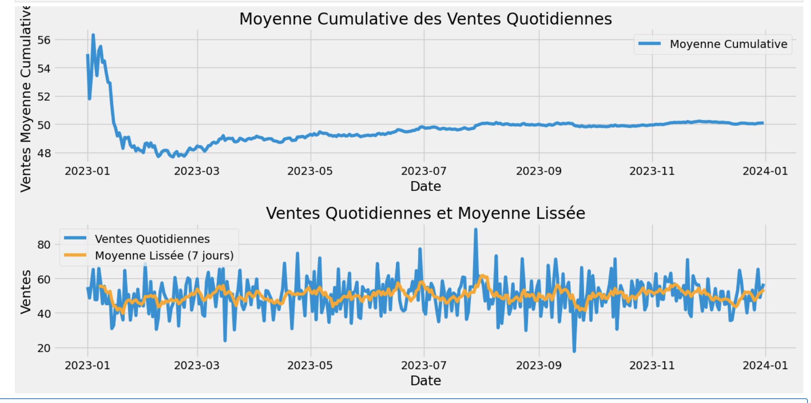
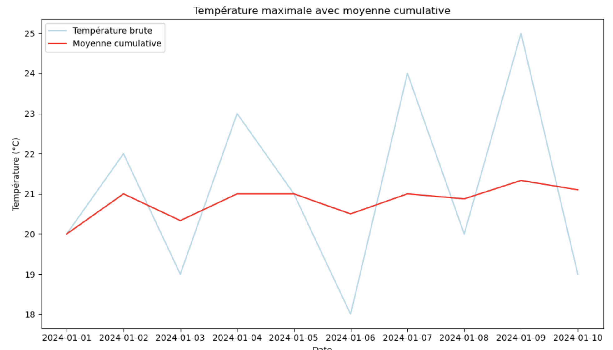

# Moyenne cumulative

### Interprétation de la Moyenne Cumulative

1. **Tendance à Long Terme** :
   - **Si la moyenne cumulative augmente constamment** : Cela indique une tendance générale à la hausse dans les valeurs des données. 
   Chaque nouvelle valeur ajoutée est en moyenne plus élevée que les valeurs précédentes.

   - **Si la moyenne cumulative diminue constamment** : Cela indique une tendance générale à la baisse dans les valeurs des données. Chaque nouvelle valeur ajoutée est en moyenne plus basse que les valeurs précédentes.

1. **Stabilité et Convergence** :
   - **Si la moyenne cumulative se stabilise** : Cela signifie que les nouvelles valeurs ajoutées sont proches de la moyenne actuelle, indiquant une stabilité dans les données.
  
   - **Convergence vers une valeur stable** : Lorsque vous avez beaucoup de points de données, la moyenne cumulative tend à se stabiliser autour d'une certaine valeur, représentant la moyenne réelle de la population ou du processus.

2. **Impact des Nouvelles Données** :
   - **Valeurs significativement différentes** : Si les nouvelles valeurs sont très différentes des précédentes, la moyenne cumulative sera influencée plus fortement, surtout au début.
  
   - **Valeurs proches de la moyenne** : Si les nouvelles valeurs sont proches de la moyenne cumulative, l'impact sera moindre, et la moyenne cumulative se stabilisera plus rapidement.



### Exemple 

Prenons un exemple avec quelques données pour illustrer comment la moyenne cumulative change au fil du temps :

| Jour | Valeur | Moyenne Cumulative |
|------|--------|--------------------|
| 1    | 20     | 20                 |
| 2    | 22     | 21                 |
| 3    | 19     | 20.33              |
| 4    | 23     | 21                 |
| 5    | 21     | 21                 |
| 6    | 18     | 20.5               |
| 7    | 24     | 21                 |
| 8    | 20     | 20.875             |
| 9    | 25     | 21.33              |
| 10   | 19     | 21                 |


La moyenne cumulative est utile pour :

- Visualiser les tendances à long terme.
- Comprendre comment les nouvelles données influencent la moyenne globale.
- Évaluer la stabilité des données au fil du temps.

Elle vous aide à comprendre si les valeurs des données augmentent ou diminuent, et comment cela affecte la moyenne globale, offrant ainsi une vue complète de l'évolution des données au fil du temps.

## Exercice graphique pour illustrer - mettre en évidence

Créez un script Python et trouvez la bonne représentation graphique.





## Génération de données

```python
import pandas as pd
import numpy as np
import matplotlib.pyplot as plt

# Configuration des paramètres
np.random.seed(42)  # Pour des résultats reproductibles
num_days = 365
mean_sales = 50  # Ventes moyennes quotidiennes
std_dev = 10  # Écart type pour simuler les fluctuations quotidiennes

# Génération des dates pour une année entière
dates = pd.date_range(start='2023-01-01', periods=num_days, freq='D')

# Génération des ventes quotidiennes avec une fluctuation autour de la moyenne
sales = np.random.normal(loc=mean_sales, scale=std_dev, size=num_days)

# Création du DataFrame
data = pd.DataFrame({'Date': dates, 'Ventes': sales})
```